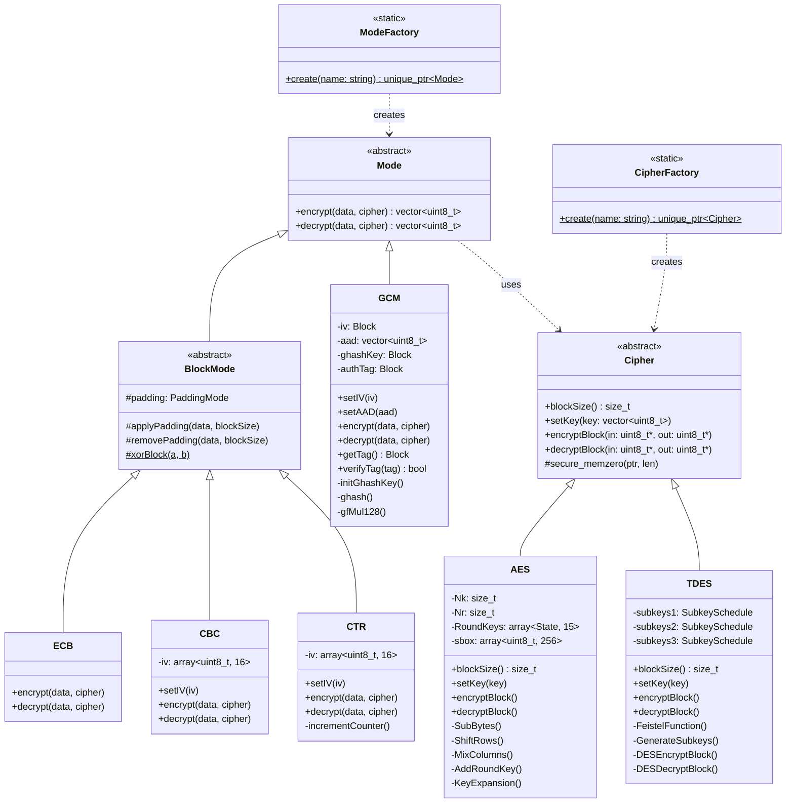

# Dokumentacja Architektoniczna - Projekt Kryptograficzny

## Spis Treści

1. [Przegląd Systemu](#1-przegląd-systemu)
2. [Wzorce Projektowe](#2-wzorce-projektowe)
3. [Zasady SOLID](#3-zasady-solid)
4. [Struktury Danych](#4-struktury-danych)
5. [Hierarchia Klas](#5-hierarchia-klas)
6. [Przepływ Danych](#6-przepływ-danych)

---

## 1. Przegląd Systemu

### 1.1 Opis Projektu

Projekt implementuje bibliotekę kryptograficzną w C++17, zawierającą:
- **Algorytmy szyfrowania blokowego**: AES (128/192/256-bit), Triple DES (3DES)
- **Tryby operacji**: ECB, CBC, CTR, GCM
- **Interfejs CLI**: Aplikacja wiersza poleceń do szyfrowania/deszyfrowania
- **Benchmarki**: Narzędzia do pomiaru wydajności

### 1.2 Architektura Warstwowa

```
┌─────────────────────────────────────────────────────────────┐
│                    WARSTWA PREZENTACJI                      │
│                      (CLI, Benchmarki)                      │
└─────────────────────────────────────────────────────────────┘
                              │
                              ▼
┌─────────────────────────────────────────────────────────────┐
│                    WARSTWA FABRYKI                          │
│              (CipherFactory, ModeFactory)                   │
└─────────────────────────────────────────────────────────────┘
                              │
                              ▼
┌─────────────────────────────────────────────────────────────┐
│                    WARSTWA ABSTRAKCJI                       │
│                  (Cipher, Mode, BlockMode)                  │
└─────────────────────────────────────────────────────────────┘
                              │
                              ▼
┌─────────────────────────────────────────────────────────────┐
│                 WARSTWA IMPLEMENTACJI                       │
│           (AES, TDES, ECB, CBC, CTR, GCM)                   │
└─────────────────────────────────────────────────────────────┘
```

### 1.3 Główne Komponenty

| Komponent | Lokalizacja | Odpowiedzialność |
|-----------|-------------|------------------|
| Cipher | `include/cipher/` | Interfejs algorytmów szyfrowania |
| AES | `src/cipher/AES/` | Implementacja AES |
| TDES | `src/cipher/TDES/` | Implementacja Triple DES |
| Mode | `include/mode/` | Interfejs trybów operacji |
| BlockMode | `src/mode/` | Bazowa klasa trybów blokowych |
| Factories | `src/utils/` | Fabryki obiektów |
| CLI | `src/cli/` | Interfejs użytkownika |

---

## 2. Wzorce Projektowe

### 2.1 Factory Pattern (Wzorzec Fabryki)

**Cel**: Oddzielenie procesu tworzenia obiektów od ich użycia.

**Implementacja w projekcie**:

#### CipherFactory

```cpp
// include/core/cipherFactory.hpp
class CipherFactory {
public:
    static std::unique_ptr<Cipher> create(const std::string& name);
};

// src/utils/cipherFactory.cpp
using FactoryFn = std::function<std::unique_ptr<Cipher>()>;

static const std::unordered_map<std::string, FactoryFn> getRegistry = {
    {"AES", []() -> std::unique_ptr<Cipher> { return std::make_unique<AES>(); }},
    {"TDES", []() -> std::unique_ptr<Cipher> { return std::make_unique<TDES>(); }}
};

std::unique_ptr<Cipher> CipherFactory::create(const std::string& name) {
    auto it = getRegistry.find(name);
    if (it == getRegistry.end()) {
        throw std::runtime_error("Unknown cipher: " + name);
    }
    return it->second();
}
```

#### ModeFactory

```cpp
// src/utils/modeFactory.cpp
std::unique_ptr<Mode> ModeFactory::create(const std::string& name) {
    if (name == "ECB") return std::make_unique<ECB>();
    if (name == "CBC") return std::make_unique<CBC>();
    if (name == "CTR") return std::make_unique<CTR>();
    throw std::runtime_error("Unknown mode: " + name);
}
```

**Korzyści**:
- Luźne powiązanie między kodem klienta a konkretnymi implementacjami
- Łatwe dodawanie nowych algorytmów bez modyfikacji istniejącego kodu
- Centralne zarządzanie tworzeniem obiektów

---

### 2.2 Strategy Pattern (Wzorzec Strategii)

**Cel**: Definiowanie rodziny algorytmów i umożliwienie ich wymiennego stosowania.

**Implementacja w projekcie**:

#### Hierarchia Cipher (Strategia Szyfrowania)

```cpp
// include/cipher/cipher.hpp
class Cipher {
public:
    virtual size_t blockSize() const = 0;
    virtual void setKey(const std::vector<uint8_t>& key) = 0;
    virtual void encryptBlock(const uint8_t* in, uint8_t* out) const = 0;
    virtual void decryptBlock(const uint8_t* in, uint8_t* out) const = 0;
    virtual ~Cipher() = default;
};

// Konkretne strategie:
class AES : public Cipher { /* ... */ };
class TDES : public Cipher { /* ... */ };
```

#### Hierarchia Mode (Strategia Trybu Operacji)

```cpp
// include/mode/mode.hpp
class Mode {
public:
    virtual ~Mode() = default;
    virtual std::vector<uint8_t> encrypt(const std::vector<uint8_t>& data,
                                          Cipher& cipher) = 0;
    virtual std::vector<uint8_t> decrypt(const std::vector<uint8_t>& data,
                                          Cipher& cipher) = 0;
};

// Konkretne strategie:
class ECB : public BlockMode { /* ... */ };
class CBC : public BlockMode { /* ... */ };
class CTR : public BlockMode { /* ... */ };
```

**Użycie w CLI**:

```cpp
// Wybór strategii w runtime
std::unique_ptr<Cipher> cipher = CipherFactory::create("AES");
std::unique_ptr<Mode> mode = ModeFactory::create("CBC");

// Użycie przez wspólny interfejs
cipher->setKey(keyBytes);
auto ciphertext = mode->encrypt(plaintext, *cipher);
```

**Korzyści**:
- Algorytmy wymienne w czasie wykonania
- Eliminacja rozbudowanych instrukcji switch/if-else
- Zgodność z zasadą Open/Closed

---

### 2.3 Template Method Pattern (Wzorzec Metody Szablonowej)

**Cel**: Definiowanie szkieletu algorytmu z możliwością nadpisania kroków przez podklasy.

**Implementacja w BlockMode**:

```cpp
// include/mode/blockMode.hpp
class BlockMode : public Mode {
protected:
    PaddingMode padding = PaddingMode::PKCS7;

    // Metody szablonowe - wspólna logika dla wszystkich trybów
    void applyPadding(std::vector<uint8_t>& data, size_t blockSize) const;
    void removePadding(std::vector<uint8_t>& data, size_t blockSize) const;
    static void xorBlock(std::array<uint8_t, 16>& a,
                         const std::array<uint8_t, 16>& b);
};

// src/mode/blockMode.cpp
void BlockMode::applyPadding(std::vector<uint8_t>& data, size_t blockSize) const {
    switch (padding) {
        case PaddingMode::PKCS7: {
            size_t padLen = blockSize - (data.size() % blockSize);
            data.insert(data.end(), padLen, static_cast<uint8_t>(padLen));
            break;
        }
        case PaddingMode::ZeroPadding: {
            size_t padLen = blockSize - (data.size() % blockSize);
            if (padLen != blockSize)
                data.insert(data.end(), padLen, 0x00);
            break;
        }
        case PaddingMode::None:
            break;
    }
}
```

**Użycie przez podklasy**:

```cpp
// src/mode/ECB.cpp
std::vector<uint8_t> ECB::encrypt(const std::vector<uint8_t>& data,
                                   Cipher& cipher) {
    std::vector<uint8_t> out = data;
    const size_t blockSize = cipher.blockSize();

    applyPadding(out, blockSize);  // Wywołanie metody szablonowej

    // Specyficzna logika ECB
    for (size_t i = 0; i < out.size(); i += blockSize) {
        cipher.encryptBlock(&out[i], &out[i]);
    }
    return out;
}
```

**Korzyści**:
- Eliminacja duplikacji kodu (padding wspólny dla ECB, CBC, CTR)
- Spójne zachowanie we wszystkich trybach
- Łatwe rozszerzanie o nowe tryby paddingu

---

### 2.4 RAII Pattern (Resource Acquisition Is Initialization)

**Cel**: Automatyczne zarządzanie zasobami poprzez czas życia obiektów.

**Implementacja**:

#### Smart Pointers w Fabrykach

```cpp
// Fabryki zwracają std::unique_ptr - automatyczne zwalnianie pamięci
std::unique_ptr<Cipher> cipher = CipherFactory::create("AES");
// Brak potrzeby manual delete - destruktor wywoływany automatycznie
```

#### SecretKey z bezpiecznym czyszczeniem pamięci

```cpp
// include/core/SecretKey.hpp
class SecretKey {
public:
    SecretKey(const SecretKey&) = delete;            // Brak kopiowania
    SecretKey& operator=(const SecretKey&) = delete;

    SecretKey(SecretKey&& other) noexcept;           // Move semantics
    SecretKey& operator=(SecretKey&& other) noexcept;

    ~SecretKey() { secure_zero(); }  // Bezpieczne zerowanie w destruktorze

private:
    void secure_zero();
    std::vector<uint8_t> data_;
};
```

#### Bezpieczne zerowanie w Cipher

```cpp
// include/cipher/cipher.hpp
class Cipher {
protected:
    inline void secure_memzero(void* ptr, std::size_t len) noexcept {
        volatile std::uint8_t* p = static_cast<volatile std::uint8_t*>(ptr);
        while (len--) {
            *p++ = 0;
        }
    }
};
```

**Korzyści**:
- Brak wycieków pamięci
- Bezpieczne czyszczenie danych wrażliwych (klucze)
- Jasna semantyka własności zasobów

---

## 3. Zasady SOLID

### 3.1 Single Responsibility Principle (SRP)

> Klasa powinna mieć tylko jeden powód do zmiany.

| Klasa | Odpowiedzialność |
|-------|------------------|
| `AES` | Tylko szyfrowanie/deszyfrowanie bloków AES |
| `CBC` | Tylko logika trybu CBC |
| `CipherFactory` | Tylko tworzenie obiektów Cipher |
| `DataConverter` | Tylko konwersja formatów danych |

**Przykład**:

```cpp
// AES odpowiada TYLKO za algorytm szyfrowania
class AES : public Cipher {
    void encryptBlock(const uint8_t* in, uint8_t* out) const override;
    void decryptBlock(const uint8_t* in, uint8_t* out) const override;
    // Brak logiki padding, trybu operacji, I/O
};

// CBC odpowiada TYLKO za tryb łańcuchowania
class CBC : public BlockMode {
    std::vector<uint8_t> encrypt(const std::vector<uint8_t>& data,
                                  Cipher& cipher) override;
    // Brak logiki algorytmu szyfrowania
};
```

---

### 3.2 Open/Closed Principle (OCP)

> Klasy powinny być otwarte na rozszerzenia, zamknięte na modyfikacje.

**Dodanie nowego algorytmu** (np. ChaCha20):

```cpp
// Nowa klasa - BEZ modyfikacji istniejących
class ChaCha20 : public Cipher {
public:
    size_t blockSize() const override { return 64; }
    void setKey(const std::vector<uint8_t>& key) override { /* ... */ }
    void encryptBlock(const uint8_t* in, uint8_t* out) const override { /* ... */ }
    void decryptBlock(const uint8_t* in, uint8_t* out) const override { /* ... */ }
};

// Tylko dodanie do rejestru fabryki
static const std::unordered_map<std::string, FactoryFn> getRegistry = {
    {"AES", []() { return std::make_unique<AES>(); }},
    {"TDES", []() { return std::make_unique<TDES>(); }},
    {"ChaCha20", []() { return std::make_unique<ChaCha20>(); }}  // NOWE
};
```

---

### 3.3 Liskov Substitution Principle (LSP)

> Obiekty klas pochodnych muszą być w pełni zastępowalne przez obiekty klas bazowych.

**Przykład**:

```cpp
void encryptData(Cipher& cipher, Mode& mode,
                 const std::vector<uint8_t>& data) {
    // Działa z KAŻDĄ implementacją Cipher i Mode
    auto result = mode.encrypt(data, cipher);
}

// Wszystkie kombinacje działają poprawnie:
AES aes; CBC cbc;
encryptData(aes, cbc, data);  // OK

TDES tdes; ECB ecb;
encryptData(tdes, ecb, data);  // OK

AES aes2; CTR ctr;
encryptData(aes2, ctr, data);  // OK
```

---

### 3.4 Interface Segregation Principle (ISP)

> Klienci nie powinni być zmuszani do zależności od interfejsów, których nie używają.

**Separacja interfejsów**:

```cpp
// Minimalny interfejs Cipher - tylko niezbędne metody
class Cipher {
    virtual size_t blockSize() const = 0;
    virtual void setKey(const std::vector<uint8_t>& key) = 0;
    virtual void encryptBlock(const uint8_t* in, uint8_t* out) const = 0;
    virtual void decryptBlock(const uint8_t* in, uint8_t* out) const = 0;
};

// Minimalny interfejs Mode
class Mode {
    virtual std::vector<uint8_t> encrypt(...) = 0;
    virtual std::vector<uint8_t> decrypt(...) = 0;
};

// BlockMode dodaje padding TYLKO dla trybów które go potrzebują
class BlockMode : public Mode {
protected:
    void applyPadding(...);
    void removePadding(...);
};

// GCM ma własny interfejs dla uwierzytelniania
class GCM {
    void setAAD(const std::vector<uint8_t>& aad);
    Block getTag() const;
    bool verifyTag(const Block& tag) const;
};
```

---

### 3.5 Dependency Inversion Principle (DIP)

> Moduły wysokiego poziomu nie powinny zależeć od modułów niskiego poziomu. Oba powinny zależeć od abstrakcji.

**Implementacja**:

```cpp
// CLI (moduł wysokiego poziomu) zależy od ABSTRAKCJI
void processEncryption(const std::string& algoName,
                       const std::string& modeName) {
    // Zależność od abstrakcji Cipher i Mode
    std::unique_ptr<Cipher> cipher = CipherFactory::create(algoName);
    std::unique_ptr<Mode> mode = ModeFactory::create(modeName);

    // Brak bezpośredniej zależności od AES, CBC, itp.
    cipher->setKey(keyBytes);
    auto result = mode->encrypt(plaintext, *cipher);
}
```

```
┌─────────────────┐
│      CLI        │  (moduł wysokiego poziomu)
└────────┬────────┘
         │ zależy od
         ▼
┌─────────────────┐
│  <<abstract>>   │
│ Cipher / Mode   │  (abstrakcje)
└────────┬────────┘
         │ implementują
         ▼
┌─────────────────┐
│  AES / TDES     │
│  ECB / CBC      │  (moduły niskiego poziomu)
└─────────────────┘
```

---

## 4. Struktury Danych

### 4.1 std::array - Bloki Stałego Rozmiaru

**Zastosowanie**: Dane o znanym rozmiarze w czasie kompilacji.

```cpp
// AES - 16-bajtowy stan
using State = std::array<uint8_t, 16>;
using RoundKeys = std::array<State, 15>;  // Klucze rundowe

// TDES - reprezentacje bitowe
using Bit64 = std::array<uint8_t, 64>;
using Bit48 = std::array<uint8_t, 48>;

// Wektory inicjalizacji w trybach
std::array<uint8_t, 16> iv = {};  // CBC, CTR, GCM
```

**Zalety**:
- Alokacja na stosie (szybsza)
- Rozmiar znany w czasie kompilacji
- Przyjazna dla cache (ciągła pamięć)

---

### 4.2 std::vector - Dane Zmiennej Długości

**Zastosowanie**: Wiadomości, klucze, teksty jawne/zaszyfrowane.

```cpp
// Klucze (różne rozmiary: 16, 24, 32 bajty dla AES)
std::vector<uint8_t> key;

// Tekst jawny/zaszyfrowany (dowolna długość)
std::vector<uint8_t> plaintext;
std::vector<uint8_t> ciphertext;

// Operacje
data.insert(data.end(), padLen, padByte);  // Padding
data.resize(newSize);                       // Usunięcie paddingu
```

**Zalety**:
- Dynamiczny rozmiar
- Automatyczne zarządzanie pamięcią
- Bogaty interfejs (insert, resize, iteratory)

---

### 4.3 std::unordered_map - Rejestr Fabryk

**Zastosowanie**: Mapowanie nazw algorytmów na funkcje fabryczne.

```cpp
using FactoryFn = std::function<std::unique_ptr<Cipher>()>;

static const std::unordered_map<std::string, FactoryFn> getRegistry = {
    {"AES", []() { return std::make_unique<AES>(); }},
    {"TDES", []() { return std::make_unique<TDES>(); }}
};

// Wyszukiwanie O(1)
auto it = getRegistry.find("AES");
return it->second();  // Wywołanie lambdy
```

**Zalety**:
- Średni czas wyszukiwania O(1)
- Łatwe rozszerzanie o nowe algorytmy
- Czytelna składnia

---

### 4.4 std::function - Funkcje Fabryczne

**Zastosowanie**: Type-erased callable wrapper dla lambd fabrycznych.

```cpp
using FactoryFn = std::function<std::unique_ptr<Cipher>()>;

// Przechowuje lambdy różnych typów
FactoryFn aesFactory = []() { return std::make_unique<AES>(); };
FactoryFn tdesFactory = []() { return std::make_unique<TDES>(); };

// Jednolite wywołanie
std::unique_ptr<Cipher> cipher = aesFactory();
```

**Zalety**:
- Ujednolicony typ dla różnych callable
- Umożliwia przechowywanie w kontenerach
- Elastyczność w definiowaniu fabryk

---

## 5. Hierarchia Klas

### 5.1 Diagram UML



### 5.2 Relacje między Klasami

| Relacja | Opis | Przykład |
|---------|------|----------|
| **Dziedziczenie** | Klasa pochodna rozszerza bazową | `AES` extends `Cipher` |
| **Kompozycja** | Obiekt zawiera inny obiekt | `BlockMode` zawiera `PaddingMode` |
| **Asocjacja** | Obiekt używa innego obiektu | `Mode::encrypt()` przyjmuje `Cipher&` |
| **Zależność** | Klasa tworzy inną klasę | `CipherFactory` tworzy `Cipher` |

---

## 6. Przepływ Danych

### 6.1 Schemat Szyfrowania

```
┌──────────────┐    ┌───────────────┐    ┌──────────────┐
│  Plaintext   │───▶│ CipherFactory │───▶│    Cipher    │
│  (vector)    │    │   .create()   │    │   (AES/TDES) │
└──────────────┘    └───────────────┘    └──────┬───────┘
                                                │
                                                │ setKey()
                                                ▼
┌──────────────┐    ┌───────────────┐    ┌──────────────┐
│  Ciphertext  │◀───│     Mode      │◀───│ ModeFactory  │
│  (vector)    │    │ .encrypt()    │    │  .create()   │
└──────────────┘    └───────────────┘    └──────────────┘
```

### 6.2 Szczegółowy Przepływ CBC

```
Plaintext: [Block1][Block2][Block3]
                │
                ▼
        ┌───────────────┐
        │ applyPadding  │
        └───────┬───────┘
                │
                ▼
        ┌───────────────┐
   IV──▶│   XOR z IV    │
        └───────┬───────┘
                │
                ▼
        ┌───────────────┐
        │ encryptBlock  │──▶ C1
        └───────┬───────┘
                │
                ▼
        ┌───────────────┐
   C1──▶│   XOR z C1    │
        └───────┬───────┘
                │
                ▼
        ┌───────────────┐
        │ encryptBlock  │──▶ C2
        └───────┬───────┘
                │
                ▼
              [...]
                │
                ▼
Ciphertext: [C1][C2][C3]
```

---

## Autorzy

- Oleksandr Abelmas
- Michał Maszka
- Vlad Bondarchuk

---
